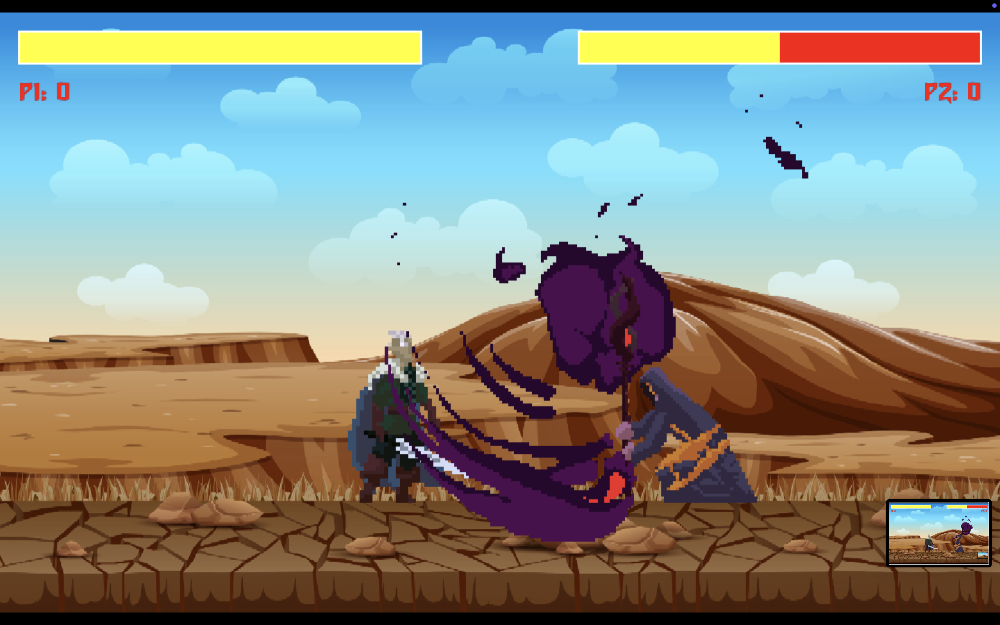

# 🕹️ 2D Retro Fighter

A local multiplayer **2D retro-style fighting game** inspired by classics like *Street Fighter*. Battle it out with pixel-punching action, vibrant retro visuals, and satisfying smackdowns!

---

## Gameplay

- **2 Players** on the same keyboard
- Retro-style combat with pixel graphics and special attacks

### Controls

#### Player 1:
- Movement: `W`, `A`, `S`, `D`
- Attacks: `E` (Attack 1), `R` (Attack 2)

#### Player 2:
- Movement: Arrow Keys (`↑ ↓ ← →`)
- Attacks: `N` (Attack 1), `M` (Attack 2)

---

##  Screenshots

---

##  Gameplay Preview
PS: The gif might be a little slow while viewing it on your browser

---

##  How to Play

1. Clone the repo
2. Run the game with Python + Pygame installed
3. Grab a friend and FIGHT!

---

Feel free to fork, play, and enhance it! ⚔️
